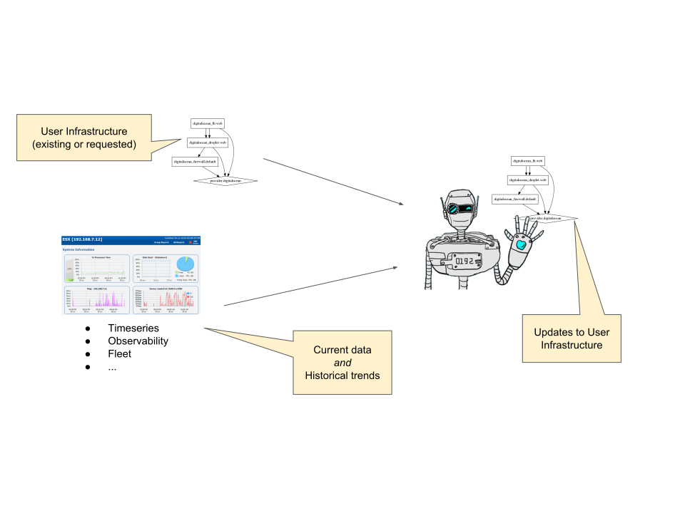

(Disclaimers: Not an officially supported DigitalOcean project, don't fly
planes with this, still WIP, etc.)

# Infrastructure Gym

Train RL models to understand and control cloud infrastructure.

Created in the spirit of openai.org/gym but we want to train RL models to use
cloud APIs to manage infrastructure intelligently.

<h4 align="center"></h4>

Here, we represent an environment in terms of (Terraform) infrastructure
graphs.  We include various ways to generate load and then measure response via
prometheus queries.  Reward is minimizing cloud infrastructure cost.

# Stacks of Services

This is a user framework for assembling (and automating) DO resources into
cloud-based applications that follow enterprise-class requirements and
best-practices for availability, redundancy, security, manageability, etc.

The primary purpose of this atm is to provide a set of building blocks to
create realistic user infrastructure graphs of varying complexity against the
DO API.

These graphs are then analyzed (used to train ML algs) in hopes of better
understanding the behavior of infrastructure topology and configuration under
various loads and constraints.

This framework also serves as a sort of control plane by which user
infrastructure graphs can be automatically manipulated to better handle those
loads and constraints.

Examples are provided here to automate the buildout of
- web-servers / web-services at scale
- docker swarm
- k8s
- ...?

# Layers

It's best-practice to separate Terraform templates into separate layers each
with independent state storage/locking.

- core (account, state buckets, infrastructure buckets, tags, network config,
  project config, etc)
- support (jump boxes, dns/service discovery, auth, key mgmt, cert mgmt, etc)
- app (servers / workers)
- edge (lb, firewalls, network config)
- etc...

## Tools

There's a `tf` utility... think of it as a missing `layer` subcommand

    # doesn't run, just for the idea
    terraform layer <layer> <action>

or plugin.  In reality, use it like this

    tf [-p <project>] [-e <environment>] [-u] <layer> <action>

