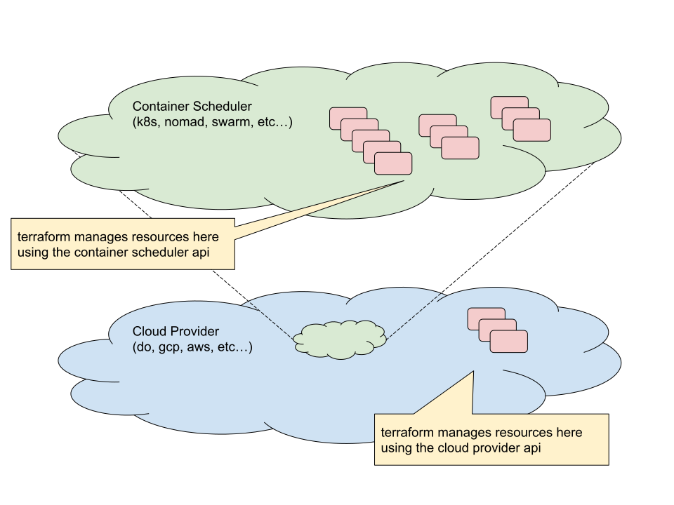

(Disclaimers: Not an officially supported DigitalOcean project, don't fly
planes with this, still WIP, etc.)

# Infrastructure Gym

Train Reinforcement-Learning (RL) agents to understand and control cloud
infrastructure.

Created in the spirit of [OpenAI's Gym](https://gym.openai.com/):

> Gym is a toolkit for developing and comparing reinforcement learning
> algorithms. It supports teaching agents everything from walking to playing
> games like Pong or Pinball.

but we want to train RL agents to use cloud APIs to manage infrastructure.

The basic idea is this would run like any [OpenAI Gym
Environment](https://gym.openai.com/docs/):

<h4 align="left">
  
</h4>

with just a few more prerequisites (cloud provider accounts) in place to
initialize the actual infrastructure for the environment.

Behind the scenes, the specific infrastructure environment (here it's
`SimpleK8sWebApp-v0`) is built using Terraform templates for each layer. This
environment can then apply/destroy the various layers appropriately whenever an
agent calls `{make, reset, step, render, close}`.

<h4 align="left">
  
</h4>

The underlying infrastructure created for this example is a really
simple web-app spun up in Kubernetes:

<h4 align="center">
  
</h4>

Here, we represent an environment in terms of (Terraform) infrastructure
graphs.  We include various ways to generate load and then measure response via
Prometheus queries.  Reward varies by example, but basically comes down to
optimizing cloud infrastructure utilization wrt cost.

To build your own infrastructure environments, and really even to _use_ such an
environment, it's important to go over the tools we use and the ways we
organize all of the infrastructure that makes up such an environment.

# Tools

The primary tool we use to manage infrastructure is
[Terraform](https://terraform.io/). There are additional provider-specific tools
(the Kubernetes provider requires `kubectl` to be installed and configured),
but let's explore some necessary concepts around Terraform before digging
through the rest of the setup process.

## Terraform Providers

Terraform supports managing infrastructure on many different [infrastructure
providers](https://www.terraform.io/docs/providers/index.html), including
many public clouds such as GCP, AWS, DigitalOcean, etc.

This current project will manage infrastructure using the following providers

- DigitalOcean (do)
- Kubernetes (k8s and helm)

<h4 align="center">
  
</h4>

Other providers can be added as needed.  There will be development effort to
get security groups, IAM roles, etc done properly on each new infrastructure
provider, but there are plenty of existing Terraform templates available.

## Infrastructure Layers

Infrastructure components are organized into [Terraform
layers](docs/terraform_layers.md):

### For the `k8s` provider

- `k8s/heater` (simple web-app cluster used to simulate a web service)
- `k8s/siege-engine` (simple web-client cluster used to generate load on heater app)
- `k8s/prometheus` (used to collect data on performance of heater)
- `k8s/postgresql` (uses the helm provider)
- `k8s/core` (namespaces, helm/tiller, etc)

### For the `do` provider

- `do/managed-k8s` start up a do-managed k8s cluster
- `do/k8s-control-plane` and `do/k8s-minions` (roll your own k8s cluster)
- `do/nomad` (roll your own nomad cluster)
- `do/swarm-manager` and `do/swarm-worker` (roll your own docker swarm cluster)
- `do/support` (bastions, consul cluster, etc)
- `do/core` do setup bits (tags, subnetting/firewalls, etc)

## Terraform Backends

Terraform tracks the state of the infrastructure it manages.  It stores this in
various (configurable)
[backends](https://www.terraform.io/docs/backends/index.html).

This project stores terraform state separately for each layer. The following
backends have been set up to use with infrastructure gym environments:

- DO spaces
- S3

Other state backends can be added as needed.

---

# Current Project Status

This is all under active development.  Trying to open-first as much as
possible, but please be patient.  I'll update status here as things become
stable enough to train external models.

- Agents and [Examples](examples/) are still very much WIP
- Docs are in a shameful state
- An API for training agents is mostly working but still WIP
