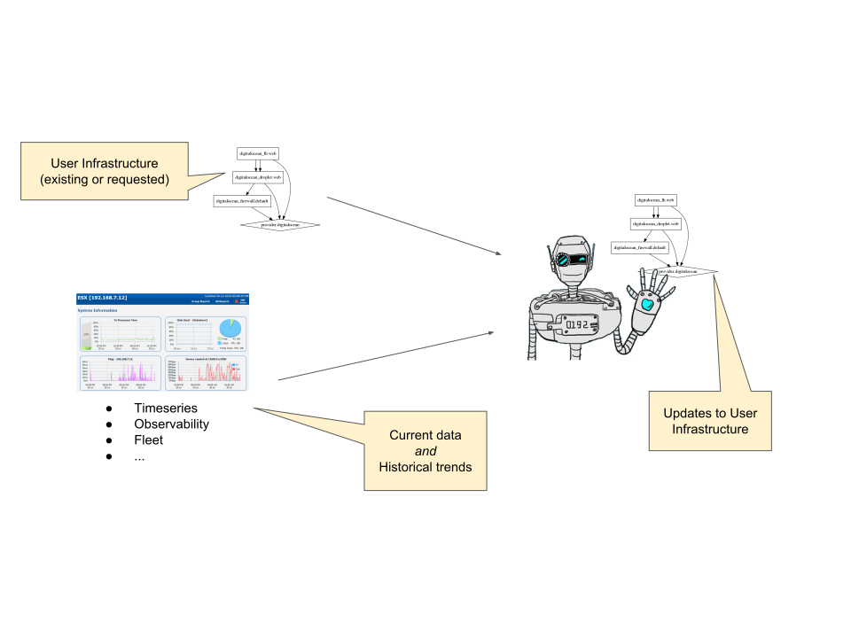
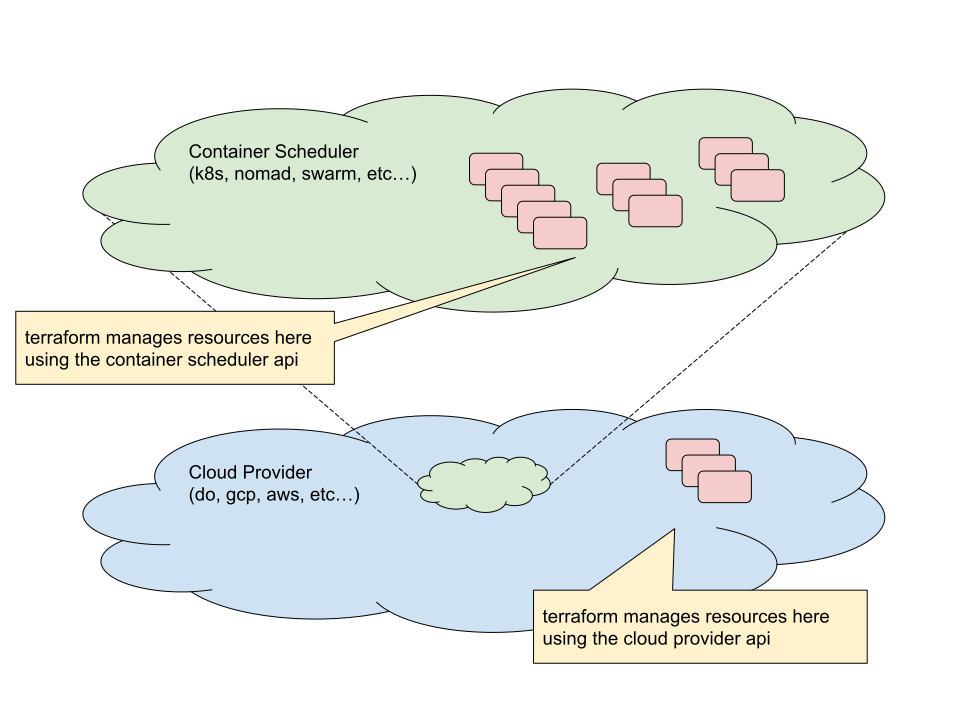

# Infrastructure Gym

Train RL models to understand and control cloud infrastructure.

Created in the spirit of openai.org/gym but we want to train RL models to use
cloud APIs to manage infrastructure intelligently.

<h4 align="center"></h4>

Here, we represent an environment in terms of (Terraform) infrastructure
graphs.  We include various ways to generate load and then measure response via
prometheus queries.  Reward is minimizing cloud infrastructure cost.

## Providers

- do
- k8s

<h4 align="center"></h4>

## Layers

Read more about [terraform layers](terraform_layers.md).

## Backends

- do spaces
- s3
- gs
